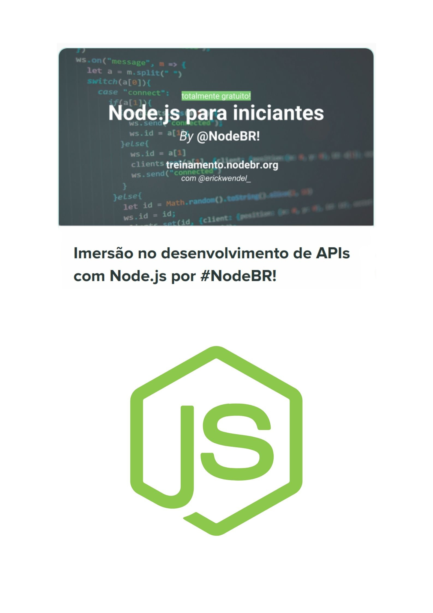

<h1 align="center">
   
</h1>

  <a href="#rocket-tecnologias">Tecnologias</a>&nbsp;&nbsp;&nbsp;|&nbsp;&nbsp;&nbsp;
  <a href="#-curso">Curso</a>&nbsp;&nbsp;&nbsp;|&nbsp;&nbsp;&nbsp;

 

## :rocket: Tecnologias

Esse projeto foi desenvolvido com as seguintes tecnologias:

- [NodeJS](https://nodejs.org/)

## 💻 Curso

Esse cuso é para o melhor apreendizado e eproveitamento dos padrões NodeJS.

## 🤔 Como contribuir

- Faça um fork desse repositório;
- Cria uma branch com a sua feature: `git checkout -b minha-feature`.
- Faça commit das suas alterações: `git commit -m 'feat: Minha nova feature'`.
- Faça push para a sua branch: `git push origin minha-feature`.

Depois que o merge da sua pull request for feito, você pode deletar a sua branch.

